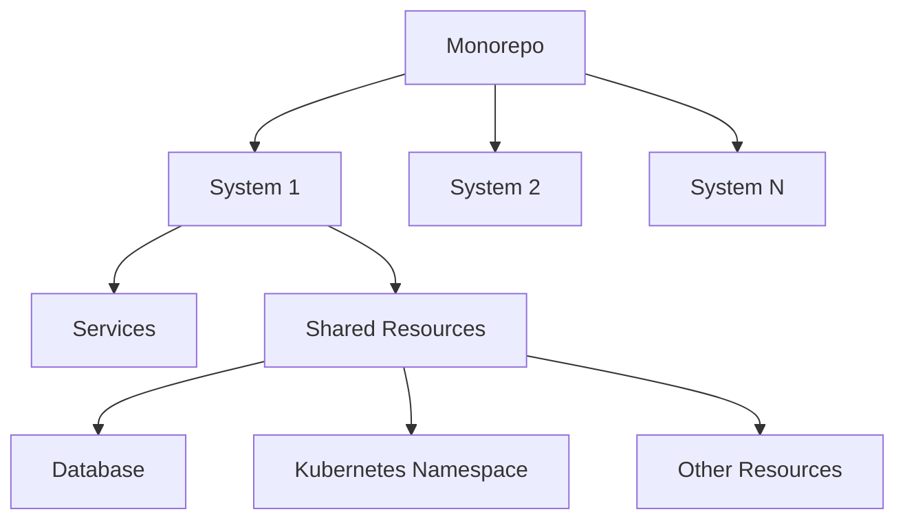
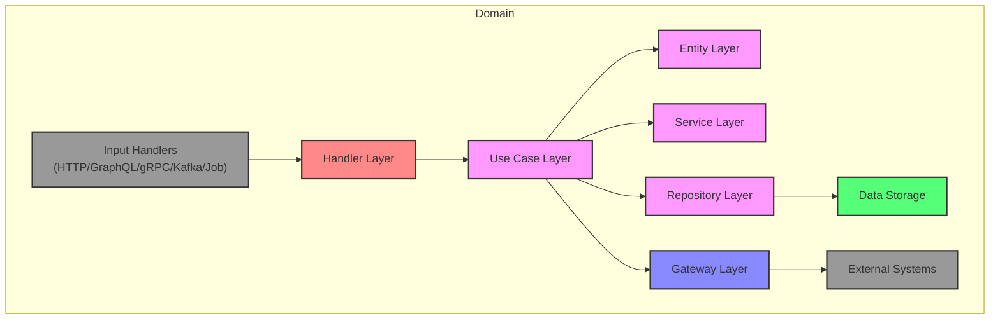
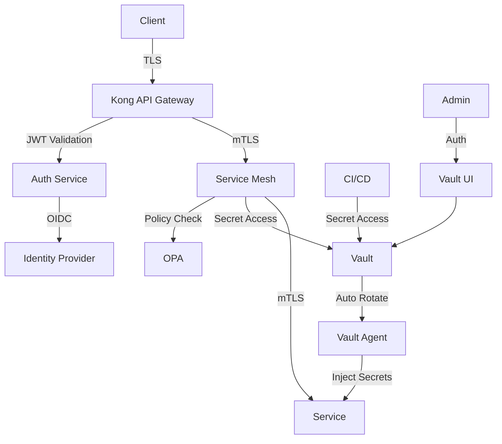

# System Architecture

> Note: This document outlines the intended architecture. Implementation will be gradual and based on system needs.
> The architecture is designed to be cloud-agnostic and heavily oriented towards open-source solutions.

## Overview

This document outlines the high-level architecture of the system, explaining how different components interact and the design principles behind the choices made.

## Repository Structure

This project follows a monorepo approach, organized as a system of systems:

Each system:

- Has its own set of services
- Shares common resources within its boundary
- Maintains isolation through Kubernetes namespaces
- Has dedicated databases and resources

## Architecture Principles

- **Clean Architecture + DDD**: Following Clean Architecture principles and Domain-Driven Design
- **Cloud-Native & Agnostic**: Built to run on any cloud platform
- **Open Source First**: Preference for open-source solutions
- **System-Based Architecture**: Organization is decomposed into independent systems, each containing multiple domain-oriented services that share common resources
- **Security-First**: Zero Trust architecture with strong authentication and authorization
- **Observable**: Comprehensive monitoring, logging, and tracing capabilities
- **Event-Driven**: Asynchronous communication through event streaming where appropriate
- **API-First**: All services expose well-defined APIs

## CleanArch + DDD Service Architecture

### Layer Responsibilities

#### Entity Layer

- Domain entities and value objects
- Core business rules and invariants
- Domain events

#### Service Layer

- Domain-specific business logic
- Complex operations involving multiple entities
- Domain event handling

#### Use Case Layer

- Application-specific business rules
- Orchestration of domain operations
- Transaction management
- Input/Output port interfaces
- Coordinates between Entity, Service, Repository, and Gateway layers

#### Repository Layer

- Data access interfaces and implementations
- Data persistence operations
- Data mapping and transformation
- Shared database access within system boundary

#### Gateway Layer

- External system integrations
- Third-party API clients
- External service communication

#### Handler Layer

- Input handling (HTTP/GraphQL/gRPC/Kafka/Job)
- Request/message validation
- Response/message formatting
- Authentication/Authorization
- Input/Output adaptation

### Quality Assurance & Security

#### Code Quality

- Comprehensive linting rules
- Automated code formatting
- Unit and integration testing
- Performance testing with k6
- Code coverage requirements

#### Security Measures

- SAST (Static Application Security Testing)
- DAST (Dynamic Application Security Testing)
- SCA (Software Composition Analysis)
- IaC (Infrastructure as Code) security scanning
- Container image scanning
- Secret scanning
- Regular security audits

#### Documentation

- Markdown for written documentation
- Mermaid for architectural diagrams
- OpenAPI/Swagger for API documentation
- Proto files for gRPC service definitions
- GraphQL schema documentation

## System Diagrams

Trunk Based Development with Pull Requests plus CI/CD (Delivery)

### SDLC, Environment Strategy & Deployment Pipeline

```mermaid
flowchart LR
    LOCAL["**Local**<br>*For Development*<br>Unit+Component Tests,<br>Static Analysis"] -->
    PR[**Feature Branch + PR**<br>Secret Scanning, Unit+Component Tests + Coverage, Static Analysis<br>SAST,SCA,IaC,Container Image Scanning<br>Build + Push Image] -->
    DEV["**Dev**<br>*Intra-system Blackbox Testing*"] -->
    MERGE[**PR Review + Merge**<br>Unit+Component Tests + Coverage, Static Analysis<br>] -->
    QA["**QA**<br>*Inter-system Testing*<br>SIT, E2E<br>DAST"] -->
    STG["**Staging**<br>*Pre-Prod Testing*<br>UAT<br>Load/Stress/Soak/Spike Test<br>Chaos Test"] -->
    RELEASE[**Release by Tagging**<br>] -->
    PROD["**Prod**<br>Live deployment"]

    classDef localStyle fill:#fff3e0,stroke:#fb8c00,stroke-width:2px,rx:10,ry:10,font-weight:bold;
    classDef devStyle fill:#e3f2fd,stroke:#1565c0,stroke-width:2px,rx:10,ry:10,font-weight:bold;
    classDef qaStyle fill:#e8f5e9,stroke:#2e7d32,stroke-width:2px,rx:10,ry:10,font-weight:bold;
    classDef stgStyle fill:#f3e5f5,stroke:#6a1b9a,stroke-width:2px,rx:10,ry:10,font-weight:bold;
    classDef prodStyle fill:#ffebee,stroke:#c62828,stroke-width:2px,rx:10,ry:10,font-weight:bold;

    class LOCAL localStyle
    class DEV devStyle
    class QA qaStyle
    class STG stgStyle
    class PROD prodStyle
```

#### SDLC Gates and Checks

| #  | Name                          | Purpose                                                                 |
|----|-------------------------------|-------------------------------------------------------------------------|
| 1  | Linters & Static Analysis     | Catch syntax, style, and basic code quality issues early (fastest).     |
| 2  | Security / Compliance Scans (SAST, SCA) | Identify known security vulnerabilities in code and dependencies. |
| 3  | Unit & Component Tests        | Validate individual functions/modules and small combined components; run locally or in ephemeral Docker. |
| 4  | PR Review (Manual Gate)       | Code review before merging into `main`.                                 |
| 5  | Blackbox / Contract Tests     | Test the system in isolation with mocks for external systems; ensures intra-system correctness. |
| 6  | IaC / Environment Provisioning | Automated provisioning of ephemeral dev/QA/staging infra (k8s, DBs, messaging). |
| 7  | Artifact Management           | Build artifacts and container images; ensure same artifact is deployed across environments. |
| 8  | QA Integration & Regression   | Inter-system integration tests, regression, DAST, and exploratory testing by QE. |
| 9  | QE Manual Checks (Manual Gate)| Exploratory and contract validation not fully automated in dev/ephemeral environments. |
| 10 | Staging Performance & Chaos Tests | Load, stress, soak, chaos, and performance tests in prod-like staging environment. |
| 11 | Biz UAT (Manual Gate)         | Business stakeholder acceptance testing in staging.                    |
| 12 | Release Approval (Manual Gate)| Manual gate to approve promotion to production (for Continuous Delivery). |
| 13 | Post-Deploy Smoke & Monitoring / Rollback | Basic sanity checks and optional rollback in production; includes monitoring setup. |

### Security Flow Diagram

