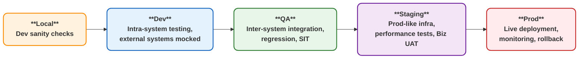

# Coruscant

Central hub for personal project management and collaboration.

## About

This is a personal project maintained by its owners. While the repository is public for transparency, we are not accepting external contributions.

## Getting Started on Local

### Prerequisites

- Docker
- Tasks

### Working with Shared Libraries

Shared libraries are maintained in the `libs/` directory. To use them:

### Setup new System

To setup new system run

```shell
task new:system:go NAME=<system_name>
```

## Environments



### SDLC

```mermaid
flowchart LR
    LOCAL["**Local Env**<br>1: Linters & Static Analysis<br>2: Security / Compliance Scans<br>3: Unit & Component Tests"] --> PR_BRANCH["**Feature PR Branch**"]
    PR_BRANCH --> DEV_K8S["**Dev Env (Ephemeral)**<br>5: Blackbox / Contract Tests<br>6: IaC / Environment Provisioning<br>7: Artifact Management"]
    DEV_K8S --> PR_REVIEW["**Manual Gate: PR Review**<br>4"]
    PR_REVIEW --> MAIN["**Trunk (main)**"]
    MAIN --> QA["**QA Deployment**<br>8: QA Integration & Regression<br>9: QE Manual Checks"]
    QA --> STG["**Staging Deployment**<br>10: Staging Perf & Chaos Tests<br>11: Biz UAT<br>12: Release Approval"]
    STG --> PROD["**Production Deployment**<br>13: Post-Deploy Smoke & Monitoring / Rollback"]

    %% Styling classes
    classDef localStyle fill:#fff3e0,stroke:#fb8c00,stroke-width:2px,rx:10,ry:10,font-weight:bold;
    classDef devStyle fill:#e3f2fd,stroke:#1565c0,stroke-width:2px,rx:10,ry:10,font-weight:bold;
    classDef qaStyle fill:#e8f5e9,stroke:#2e7d32,stroke-width:2px,rx:10,ry:10,font-weight:bold;
    classDef stgStyle fill:#f3e5f5,stroke:#6a1b9a,stroke-width:2px,rx:10,ry:10,font-weight:bold;
    classDef prodStyle fill:#ffebee,stroke:#c62828,stroke-width:2px,rx:10,ry:10,font-weight:bold;

    %% Apply classes
    class LOCAL localStyle
    class PR_BRANCH devStyle
    class DEV_K8S devStyle
    class PR_REVIEW devStyle
    class MAIN devStyle
    class QA qaStyle
    class STG stgStyle
    class PROD prodStyle
```



| #  | Name                          | Purpose                                                                 |
|----|-------------------------------|-------------------------------------------------------------------------|
| 1  | Linters & Static Analysis     | Catch syntax, style, and basic code quality issues early (fastest).     |
| 2  | Security / Compliance Scans (SAST, SCA) | Identify known security vulnerabilities in code and dependencies. |
| 3  | Unit & Component Tests        | Validate individual functions/modules and small combined components; run locally or in ephemeral Docker. |
| 4  | PR Review (Manual Gate)       | Code review before merging into `main`.                                 |
| 5  | Blackbox / Contract Tests     | Test the system in isolation with mocks for external systems; ensures intra-system correctness. |
| 6  | IaC / Environment Provisioning | Automated provisioning of ephemeral dev/QA/staging infra (k8s, DBs, messaging). |
| 7  | Artifact Management           | Build artifacts and container images; ensure same artifact is deployed across environments. |
| 8  | QA Integration & Regression   | Inter-system integration tests, regression, DAST, and exploratory testing by QE. |
| 9  | QE Manual Checks (Manual Gate)| Exploratory and contract validation not fully automated in dev/ephemeral environments. |
| 10 | Staging Performance & Chaos Tests | Load, stress, soak, chaos, and performance tests in prod-like staging environment. |
| 11 | Biz UAT (Manual Gate)         | Business stakeholder acceptance testing in staging.                    |
| 12 | Release Approval (Manual Gate)| Manual gate to approve promotion to production (for Continuous Delivery). |
| 13 | Post-Deploy Smoke & Monitoring / Rollback | Basic sanity checks and optional rollback in production; includes monitoring setup. |

## Development

This project is maintained by its owners. For collaboration guidelines, please refer to:

- [Code of Conduct](CODE_OF_CONDUCT.md)
- [Contributing Guidelines](CONTRIBUTING.md)
- [Security Policy](SECURITY.md)

## License

This project is licensed under the MIT License - see the [LICENSE](LICENSE) file for details.

Copyright (c) 2025 kneadCODE
